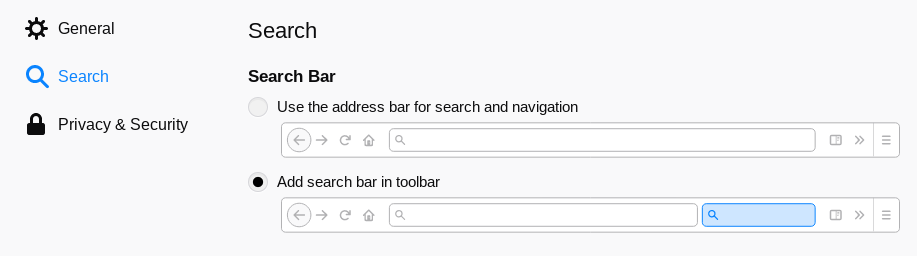
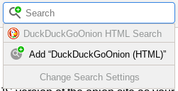
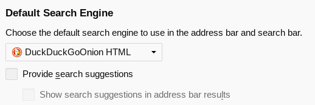

# DuckDuckGo Onion HTML Opensearch

This is a [custom](opensearch.xml) [`opensearch.xml`](https://en.wikipedia.org/wiki/OpenSearch) for [DuckDuckGo's onion site](https://3g2upl4pq6kufc4m.onion/). Visiting this page allows you to install the no-JS version of DDG's onion site as your default search engine in e.g. Tor Browser.

On the highest "security level" in Tor Browser, no JavaScript is executed, so whenever one searches you're redirected from the main search page to the HTML-only version. This redirect could easily be avoided if DuckDuckGo provided an opensearch meta tag for the HTML-only onion site. There are separate opensearch.xml files for the other 3 possible combinations (DuckDuckGo JS clearnet, DuckDuckGo HTML clearnet, DuckDuckGo JS onion) but not for the no-JS onion site.

Until now!

## Usage

First enable the separate search box in `about:preferences`:

Then go to this page at its [canonical URL](https://milkey-mouse.github.io/duckduckgo-onion-opensearch/).
In the search box, a plus icon should appear on the magnifying glass. Click the icon and you should be presented with the option to add "DuckDuckGoOnion (HTML)":

Once installed, go back to `about:preferences` and you should be able to set it as the default.

